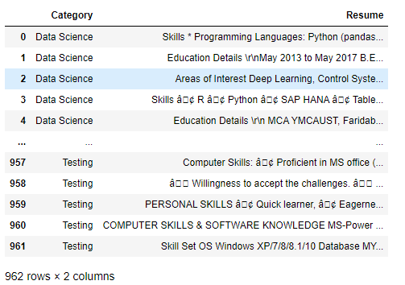

# A Graph-based Hybrid Job Recommender

*Attention: Do not mind the `Julia` language on the right, I don't use the Julia language in this project, it's the jsonline file extension `.jl`(jsonline is just like json but each line is a json object.) that makes GitHub think I used Julia. This project is written in Python.*

[The Ultimate Jobs Recommender · Streamlit](https://share.streamlit.io/huynhnhathao/job_recommender/main/recommender/core/my_web_app.py)

This is how it looks like:

## Abstract

In this project, we will implement a Recommender system from scratch using Python. We will crawl data from a job seeking website using [Scrapy](https://scrapy.org/), store it into a Pandas DataFrame, then we'll build a graph network to express different entities and relations between them using [Networkx](https://networkx.org/documentation/stable/index.html). Then we'll use Personalized PageRank algorithm to recommend personalized jobs to a new user. Finally, we'll build a demo using [Streamlit • The fastest way to build and share data apps](https://streamlit.io/). 

## Problem Definition

Consider a scenario in which a candidate access to a job seeking website and she want to find a few good relevant jobs out of thousand of available jobs and employers. She tell the  recommender system(RS) her expertise and resume, then she proceed to enter a keyword(Blockchain Engineer, for example), out of hundred of  jobs has the same title Blockchain Engineer, how the RS rank and order most relevant jobs to suggest to the candidate such that it takes into account the candidate's resume, expertise and the searched keyword?

## Step number 1: Crawl data

The first thing we need is data. We need information about companies, its description, all the jobs that posted by each company and the job's description. For this, we will use Scrapy to crawl data from itviec.com, an IT jobs seeking website in Vietnam. All the code to do just that is in crawl_data folder. Here are the result dataframes:

 **Companies dataframe**

**Jobs dataframe**

These two dataframes are still not enough, we need data about previous candidates who used our recommender system. For that, we can not crawl from the website, but we'll use a Resume dataset from [Resume Dataset | Kaggle](https://www.kaggle.com/gauravduttakiit/resume-dataset). This dataset has resume and expertise of candidate, mostly in the IT industry. Here is how it look like:

We have more than 900 resumes, those resumes will play as candidates node in our job recommender network.

## Step number 2: Build the network

After we have all the data we want, now is the time to do some coding exercises. All the code to build the graph is in recommender/core. Where network_builder.py build the network using Networkx and save the network to disk, constants.py contains all the arguments for our building process(I know I should have named it arguments.py), latent_semantic_analysis.py defines the method to compare two nodes and decide if they are similar enough to be considered similar!, job_recommender.py defines the main class that will recommend jobs to us. 

## Step number 3: Build the demo

After we constructed and saved the network into disk, now we will build a demo to run our recommender using the saved graph, because everyone prefers a beautiful interactive web demo to a Jupyter notebook demo. For this, we will use Streamlit, all the code is in recommender/demo.

## How to build the network?

In this section, I will describe the semantic of the network that we will build to express our three dataframes and leverage it to recommend nodes to users.

### Types of nodes

We define the set of node types by $D = \{E, J, C\}$ where E are employer nodes, J are job  nodes and C are candidate nodes.

### Types of connections

Similarity between two entities are judged by Latent Sematic Analysis(LSA) and Cosine similarity by default, unless otherwise stated.

1. Connections between entities of the same type:
   1. **Employer to employer**: if two employers have similar profile description, they are connected together.
   1. **Job to job**: if two jobs have similar description, they are connected together.
   1. **Candidate to candidate**: if two candidate have similar resumes or they have the same `expertise` stated in their resume , they are connected together. 
2. Connections between entities of different types:
   1. **Candidate to job**: if a candidate's resume similar to a job's description, they are connected together.

3. Connection by history of interactions:
   1. If a candidate `apply`,` favorite`, `like`, `visit` an employer/job, they are connected by these types of edges.

4. Employer and job connection:
   1. Employer and his/her jobs are connected together by `posted` edges.

The next question is how similar is considered similar, we use a (kind of) heuristic way to set the similarity threshold: if the Cosine similarity > 0.4, they are similar. This threshold is configurable.

Another question is how to set the weight for different edge types, since obviously these types of edges can not have the same weight, for example, an `apply` edge between a candidate and a job must be stronger than a `like` edge between that candidate with another job. We need to set these weights such that when using ranking algorithm on the network it ranks more relevant nodes higher than less relevant nodes. But we choose to set it heuristically by manually set weights that fit our intuition.

#### But what's latent semantic analysis?

Latent semantic analysis is just a fancy name of **Term Frequency — Inverse Document Frequency(TF-IDF)** combine with **singular value decomposition**. Intuitively, it represents our documents by vectors so that we can use Cosine similarity or K-nearest neighbors to compare documents and decide if they are similar enough to be considered similar!

### Four main ideas

1. **Graph construction**. Model the inter-relations between entities in a heterogeneous and multi-relational directed graph. The nodes are employers, jobs and candidates, and the edges are inter-relations between them. Bi-directional relations are translated into two directed edges, for example, `similar` between two candidates can be represented by 2 directed `similar` edges between them.  The explicit relations between nodes, for example employer `posted` a job, will be translated into 2 edges `posted` between them.
2.  **Context definition**. If the candidate search for jobs/employers using a keyword, then every nodes matched that keyword is the context at hand. If the candidate choosing an employer, then every node relates to the employer node become the context. The algorithm is expected to bias results towards the context in such a way that entities that have strong connections to contextual nodes get important ranking, this will lead to suggesting new relevant entities to the target actor depending on the strength of their connection to contextual nodes.
3. **Importance calculation**. Once the graph is formed and the context is defined, we need an algorithm to rank the importance of nodes such that it takes into account the context nodes and the target user node. Personalized PageRank is just the right algorithm to do what we want.
4. **Rank list extraction**. A list of entities ordered by their ranking importance will be recommended to the user.

## But what's Personalized PageRank?

In this section, I will attempt to explain the Personalized PageRank algorithm's ideas. For a more rigorous and better explanation, take a look at *Recommender Systems: The Textbook by Charu C. Aggarwal, chapter 10: Structural recommendations in Networks.* 

## PageRank algorithm

Imagine a random walker who randomly visit websites to websites, the next website this random walker is going to visit depends on whether it is linked in the current website. In this model, websites are nodes and links are edges, if a website point to another website by citing it, there will has an edge between the citing website to the cited website. Now imagine that the random walker will walk a billion times(or approach infinity), then we count the number of times he visit each node in the network. **The rank of a node** is the normalized number of times that random walker visit that node. We can obtain the probability of a random walker visit a node by divide the number of times he visit that node to all of his visiting times. We need two modifications for this model to work:

- If a node does not link to any one, then it is called a dead end, we have to point that node to all the node in the network including itself, then the probability of moving from that node to other node is $\frac{1}{n}$, because all the nodes in the network have equally chance of being visited by the random walker when he is in that node.
- If a group of node is isolated and does not has any link out of that group, then it is called a dead end component. If the random walker fall into this component, he will never see light again, as a result, all the probability will concentrate into that group. To prevent that, we need to define a teleportation probability to any other node in the network. At each transition, the random surfer may either jump to an arbitrary page with probability α, or follow one of the links on the page with probability (1 − α). $\alpha$ is also known as damping probability.

That's it for the ideas of the PageRank algorithm.

## Personalized PageRank

The key idea is using the teleportation probability to *bias toward the context nodes.* For example, if a user search for jobs using a keyword, first we will find all jobs, employers that match the keywords, then we'll use  PageRank on our network, but this time we'll set the teleportation only on those context nodes(the results) and the target user node. By doing this, we are biasing the searching results toward the user node and his neighbors, since if the random walker have to comeback to the user node multiple times, the probability of the random walker to visit the user's neighbor nodes will be increased, thus biasing the results ranking towards the user node. 

User can choose which skills he has, then the search results respond to him will *bias toward these skill, expertise.*

## Discussion

The network we described above is called heterogeneous network, because it has many different node types and edge types. In fact, there is a(probably better) way to solve our problem, which is called *SocialRank algorithm*, which was designed just to rank nodes in a heterogeneous network as ours. But here we use a simpler approach which only use Personalized PageRank to rank nodes.  If you are interested in this, you can take a look at [Ranking in heterogeneous social media | Proceedings of the 7th ACM international conference on Web search and data mining](https://dl.acm.org/doi/10.1145/2556195.2556254).

## References

1. [A Recommender System for Job Seeking and Recruiting Website](http://www2013.w3c.br/companion/p963.pdf)
2.  [Ranking in Heterogeneous Social Media](https://dl.acm.org/doi/10.1145/2556195.2556254).
3. [The 3A Personalized, Contextual and Relation-based  Recommender System](http://citeseerx.ist.psu.edu/viewdoc/summary?doi=10.1.1.430.732)

## Last words

If you learn anything new from this project, consider `STAR` it.

If you use any part of this project in your work, please cite it by a direct link to this page.

